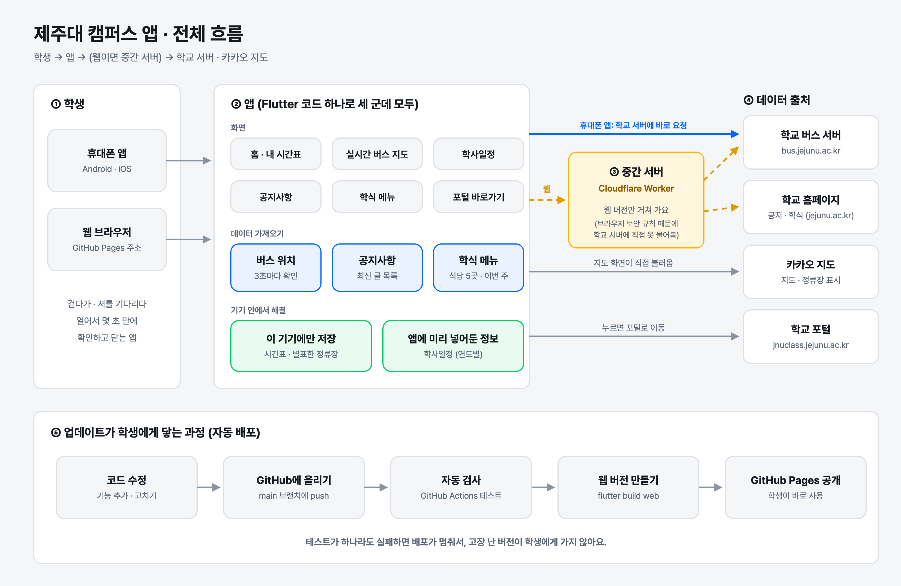

# 제주대 캠퍼스 앱 (school_bus_app)

제주대학교 학생을 위한 캠퍼스 생활 앱입니다.
**순환 셔틀버스가 지금 어디 있는지**, 학사일정, 학교 공지, 오늘의 학식 메뉴, 내 수업 시간표를 한 곳에서 몇 초 만에 확인할 수 있어요.

👉 **웹에서 바로 써 보기:** https://munho-kang.github.io/school_bus_app/

> 학생이 만든 비공식 프로젝트이며, 학교 공식 앱이 아닙니다.

## 주요 기능

| 화면 | 하는 일 |
| --- | --- |
| 🏠 홈 | 내 수업 시간표(월~금)와 버스 카드. 지도에서 별표한 정류장의 다음 도착 시각을 크게 보여 줘요. |
| 🚌 실시간 버스 지도 | 카카오 지도 위에 A코스(파랑)·B코스(초록) 버스 위치를 3초마다 갱신. 정류장을 누르면 노선별 도착 예정 시각이 나와요. |
| 📅 학사일정 | 달력으로 학사일정을 보고, 날짜를 누르면 그날 일정을 자세히 보여 줘요. |
| 📢 공지사항 | 학교 홈페이지 공지를 분류별로 모아 보고, 제목을 누르면 원문으로 이동해요. |
| 🍚 학식 메뉴 | 식당 5곳(백두관, 사라캠퍼스, 생활관 6호관·1호관, 교수회관)의 이번 주 식단. 오늘 카드를 강조해요. |
| 🎓 포털 바로가기 | 학교 포털(jnuclass)로 한 번에 이동해요. |

## 장점

1. **흩어진 정보를 한 곳에** — 버스, 공지, 학식, 학사일정이 학교 사이트 여기저기에 나뉘어 있던 것을 앱 하나로 모았어요.
2. **몇 초면 끝나는 화면** — 걷다가, 셔틀을 기다리다가 열어도 가장 급한 정보(다음 버스, 오늘 메뉴)가 첫눈에 보이도록 만들었어요.
3. **진짜 실시간 데이터** — 학교 버스 서버에서 위치를 직접 받아 오고, 데이터가 오래됐거나 못 받았을 때는 솔직하게 알려 줘요.
4. **한 번 만들어 세 곳에서** — Flutter 코드 하나로 Android, iOS, 웹이 같은 모습으로 동작해요.
5. **개인 정보는 내 기기에만** — 시간표와 별표한 정류장은 서버로 보내지 않고 이 기기에만 저장해요.
6. **고장 난 버전이 나가지 않는 자동 배포** — 코드를 올리면 테스트를 자동으로 돌리고, 모두 통과해야만 웹에 공개돼요.

## 전체 흐름도



- **휴대폰 앱**은 학교 서버에 바로 물어봐요.
- **웹 버전**은 브라우저 보안 규칙 때문에 학교 서버에 직접 물어볼 수 없어서, 중간 서버(Cloudflare Worker, `bus_relay/`)가 대신 받아 전달해요.

## 폴더 구성

```
school_bus_app/
├── bus_tracker/   # Flutter 앱 (Android · iOS · 웹)
│   ├── lib/ui/        화면
│   ├── lib/services/  버스·공지·학식 데이터 가져오기
│   ├── lib/data/      학사일정
│   └── assets/web/    카카오 지도 페이지
├── bus_relay/     # 웹 버전용 중간 서버 (Cloudflare Worker)
└── .github/workflows/deploy.yml  # 자동 테스트 + 웹 배포
```

## 직접 실행해 보기

[Flutter](https://docs.flutter.dev/get-started/install)가 설치되어 있어야 해요.

```bash
cd bus_tracker
flutter pub get      # 필요한 부품 내려받기
flutter run          # 연결된 휴대폰이나 에뮬레이터에서 실행
flutter test         # 테스트 실행
```

## 사용 기술

- **앱:** Flutter (Dart), 카카오 지도
- **중간 서버:** Cloudflare Workers
- **배포:** GitHub Actions → GitHub Pages
